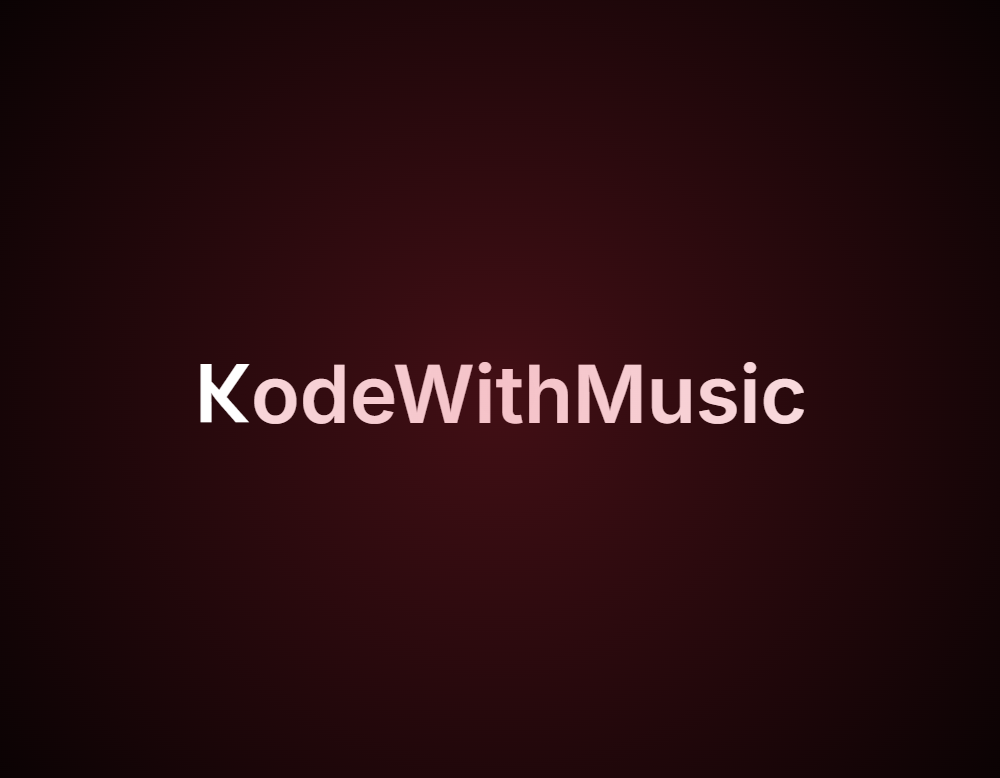
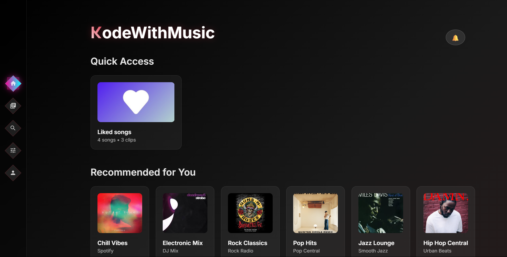

# KodeWithMusic 🎵💻

Where coding meets creativity - an innovative platform that harmonizes programming and music for an enhanced development experience.  

## 🚀 Live Demo

🔗 **[Experience KodeWithMusic](https://kode-with-music.vercel.app/)**  

## 📋 Overview

KodeWithMusic is a unique web application that bridges the gap between coding and music, creating an immersive environment where developers can enhance their programming experience through the power of sound. Whether you're looking to code with ambient music, learn programming concepts through musical analogies, or explore the intersection of technology and creativity, KodeWithMusic provides an engaging platform that makes coding more enjoyable and productive.

The platform combines intuitive design with powerful functionality, offering users a seamless experience that transforms the traditional coding environment into something more inspiring and motivating.  

## 📸 Screenshots  

     
